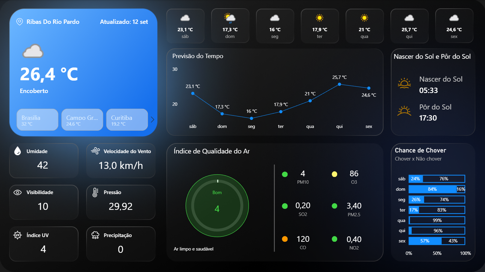

# ⛅ Dashboard de Previsão do Tempo | Power BI

Um dashboard interativo desenvolvido em Power BI para monitoramento meteorológico e análise de qualidade do ar, consumindo dados diretamente da **WeatherAPI**. 

## 📊 Sobre o Projeto
Este projeto tem como objetivo consolidar dados climáticos de múltiplas cidades em uma interface limpa, moderna (Dark/Neon UI) e de fácil leitura. Ele permite acompanhar as condições atuais e a previsão para os próximos dias, aplicando lógicas condicionais em DAX para classificar indicadores críticos de saúde, como o Índice de Qualidade do Ar (IQA).

## 🚀 Principais Funcionalidades e Métricas
*   **Integração de Dados:** Conexão com a WeatherAPI para extração de dados climáticos atualizados.
*   **Qualidade do Ar (AQI - PM10):** Classificação automatizada do nível de poluição usando a função `SWITCH` em DAX, retornando recomendações de saúde dinâmicas (ex: "Ar limpo e saudável", "Insalubre para Grupos Sensíveis").
*   **Previsão Analítica:** Gráfico de barras 100% empilhadas detalhando a probabilidade de chuva (Chover x Não Chover) para os próximos dias.
*   **Indicadores de Tempo Real:** Monitoramento de temperatura, umidade, velocidade do vento, pressão atmosférica, índice UV e visibilidade.
*   **Navegação Dinâmica:** Filtros interativos para alternar instantaneamente entre diferentes localidades (Ribas do Rio Pardo, Rio de Janeiro e São Paulo).

## 🛠️ Tecnologias Utilizadas
*   **Microsoft Power BI:** Modelagem de dados, construção do relatório e UI/UX.
*   **DAX (Data Analysis Expressions):** Criação de medidas calculadas, tratamento de decimais e formatação condicional de texto.
*   **WeatherAPI:** Fonte de extração dos dados meteorológicos.
